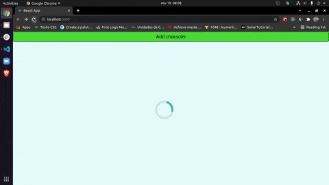
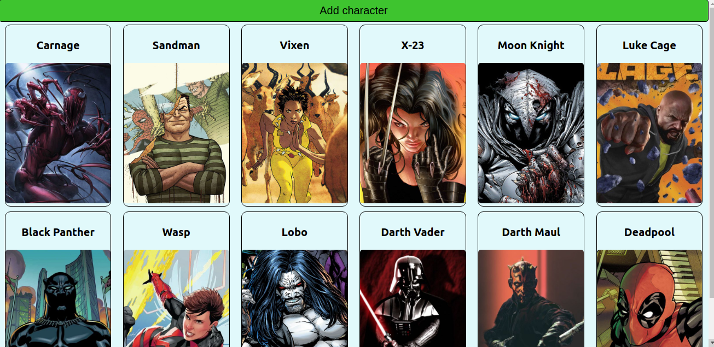

# Bem vindo ao repositório do projeto Caracters-card

Esse projeto foi desenvolvido como um projeto de revisão do conteúdo de React, para as pessoas estudantes do curso de Desenvolvimento Web da Trybe, o objetivo desse projeto era construir uma aplicação onde seria possivel criar cartões de alguns personagens de quadrinhos e filmes, as tecnologias usadas para desenvolver esse projeto foram React e CSS.

Este projeto teve como objetivo praticar fluxo de requisição a uma API e criar páginas de detalhes para cada personagem, de forma dinâmica.

Feito apenas com propósitos educacionais.

---

## Preview do projeto

---

## Instalação do projeto localmente

Após cada um dos passos, haverá um exemplo do comando a ser digitado para fazer o que está sendo pedido, caso tenha dificuldades e o exemplo não seja suficiente, não hesite em me contatar em *iago.pferreiravr@gmail.com*.

Passo 1. Abra o terminal e crie um duretório no local de sua preferência com o comando `mkdir`:

~~~bash
mkdir projetos
~~~

Passo 2. Entre no diretório que você acabou de criar:

~~~bash
cd projetos
~~~

Passo 3. Clone o projeto:

~~~bash
git clone git@github.com:IagoPFerreira/caracters-card.git
~~~

Passo 4. Após terminado a clonagem, entre no diretório que você acabou de clonar:

~~~bash
cd caracters-card
~~~

Passo 5. Instale todas as dependências do projeto:

~~~bash
npm install
~~~

Passo 6. Após a instalação das dependências, rode a aplicação

~~~bash
npm start
~~~

A aplicação será aberta no seu navegador automaticamente, e ela deve se parecer com essa:

---

---
